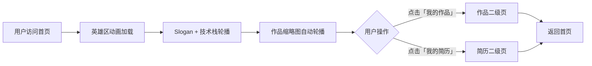

# ElimiDesign 个人作品集网站 PRD

## 1. Product Overview
ElimiDesign 是展示设计师 Emily Ding 个人品牌、作品集与专业简历的官方个人作品集网站。
- 目标用户：潜在客户、招聘方、设计同行；核心目的：打造专业、有记忆点的个人品牌展示。
- 市场价值：通过独特视觉语言（科技感 + 简约风 + 精致排版）建立差异化个人品牌认知。

## 2. Core Features

### 2.2 Feature Module
1. **首页（Home）**：顶部导航栏、动态图形英雄区、技术栈文本轮播、项目缩略图自动轮播
2. **我的作品（Works）**：作品集详情二级页（跳转子页面）
3. **我的简历（Resume）**：个人简历二级页

### 2.3 Page Details
| Page Name | Module Name | Feature description |
|-----------|-------------|---------------------|
| 首页 | 顶部导航栏 | 左侧品牌 Logo「ElimiDesign」，右侧跳转按钮「我的作品」「我的简历」 |
| 首页 | 英雄区 | 科技感动态几何图形主图（渐变色块 + 线条 + 标记符号），居中大字号 Slogan「Make it happen」，下方自动轮播技术栈文本 |
| 首页 | 技术栈轮播 | UI&UX Design · Agentic Design · AIGC · Creative Design · Animation Design |
| 首页 | 作品集展示区 | 项目缩略图卡片，每 3 秒自动轮播切换，展示项目封面 |
| 我的作品 | 作品列表 | 网格展示所有作品缩略图，可点击查看详情 |
| 我的简历 | 简历展示 | 个人信息、教育经历、工作经历、技能雷达、联系方式 |

## 3. Core Process
用户打开首页 → 看到英雄区 Slogan 与动态图形 → 浏览技术栈文本 → 滚动查看自动轮播作品 → 点击导航「我的作品」跳转 → 或点击「我的简历」跳转 → 返回首页。

## 4. User Interface Design

### 4.1 Design Style
参考 Tracebit 设计风格，打造"科技感 + 简约风 + 精致视觉细节"的美学调性：
- **主色**：米白背景 `#F6F1EC`，深黑色文字 `#1A1A1A`
- **渐变色**：粉橘渐变 + 淡黄渐变组成的柔和光晕（科技感配色）
- **点缀色**：深黑色块 / 线条符号（如参考图中的 ✕ 标记线条图形）
- **按钮**：圆角黑色按钮 + 白色文字，辅按钮为浅灰透明胶囊
- **字体**：采用现代无衬线字体 - 使用 `Instrument Serif` 或类似显示字体作大标题，正文使用精炼无衬线字体
- **字号层次**：Hero 大标题使用巨大字号（如 7rem+ 粗体），正文适中（1rem 左右）
- **布局**：整页单栏大留白布局，元素重叠与非对称排版，打破网格
- **视觉细节**：渐变色块背景、细斜线几何线条、标记符号（如 `✕` / `○` / `+`）、细腻投影、微妙噪点纹理

### 4.2 Page Design Overview
| Page Name | Module Name | UI Elements |
|-----------|-------------|-------------|
| 首页 | 顶部导航栏 | 固定定位；左侧 Logo「ElimiDesign」；右侧胶囊按钮组「我的作品」「我的简历」 |
| 首页 | 英雄区 | 全屏高度；左侧大标题「Make it happen」；右侧动态几何图形（渐变色块 + 旋转线条 + ✕ 标记）；下方技术栈文本横向滚动；背景带渐变色晕染 |
| 首页 | 作品集展示 | 宽幅卡片容器，左右箭头可手动切换，每 3 秒自动轮播；卡片悬停缩放；展示项目缩略图 + 标题 + 标签 |
| 我的作品 | 作品网格 | 3 列响应式网格，每个作品为卡片，点击进入详情 |
| 我的简历 | 简历内容 | 双栏布局；左侧个人信息/技能；右侧经历时间线 |

### 4.3 技术栈轮播动画
- 5 个关键词依次横向滚动：`UI&UX Design · Agentic Design · AIGC · Creative Design · Animation Design`
- 使用 CSS marquee / transform 实现无缝循环
- 关键词之间用点号分隔

### 4.4 作品集轮播
- 自动轮播，切换间隔 3 秒
- 支持手动左右箭头切换与暂停悬停
- 展示项目缩略图、项目名、项目标签

### 4.5 动态英雄区图形
- 用 SVG + CSS 动画绘制科技感几何图形
- 渐变色块缓慢旋转 / 缩放 / 位移
- 细线条装饰（类似参考图的斜线网络）
- `✕` 标记符号轻微抖动 + 旋转
- 鼠标跟随微交互（视差效果）

### 4.6 响应式
- 桌面优先（1440px / 1280px）
- 平板：自动调整字号与栅格列数（作品网格变 2 列）
- 手机：单列、字号缩小、导航水平压缩
- 触摸优化：按钮最小点击区域 44×44px

### 4.7 动画与交互
- 页面加载：元素错峰淡入（staggered fade-in）
- 悬停：卡片轻微上浮 + 阴影加深 + 缩放
- 滚动：渐变色块随滚动轻微位移
- 导航：滚动时轻微模糊背景（毛玻璃效果）
