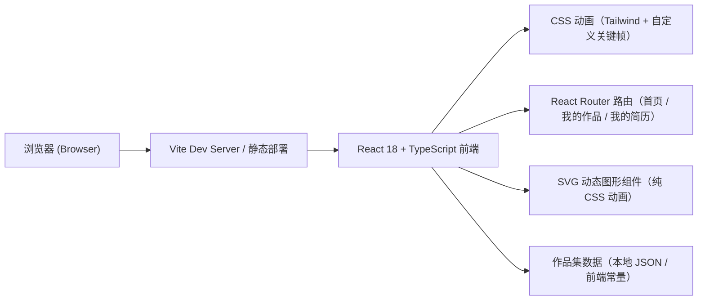

# ElimiDesign 个人作品集网站 技术架构

## 1. Architecture Design


## 2. Technology Description
- **Frontend**: React@18 + TypeScript@5 + Vite@5 + Tailwind CSS@3
- **初始化方式**: 使用 `vite-init` 初始化项目
- **Backend**: None（纯前端静态网站，作品集数据硬编码在前端）
- **路由**: React Router DOM v6
- **动画**: CSS `@keyframes` + Tailwind 自定义动画类 + 少量 requestAnimationFrame 鼠标视差
- **字体**: Google Fonts - 大标题使用 `Instrument Serif` (display serif)，正文使用 `Inter`

## 3. Route Definitions
| Route | Purpose |
|-------|---------|
| `/` | 首页（导航栏 + 英雄区 + 技术栈轮播 + 作品缩略图轮播） |
| `/works` | 我的作品（作品网格列表页） |
| `/resume` | 我的简历（个人简历页） |

## 4. API Definitions
无后端 API，作品集与简历数据均以 TypeScript 常量（或 JSON 文件）形式内置在前端。

### 数据模型
```ts
// 项目作品数据结构
interface Project {
  id: string;
  title: string;
  subtitle: string;
  tags: string[];
  coverColor: string; // 项目缩略图背景渐变色（CSS gradient 字符串）
  accentSymbol: 'x' | 'o' | 'plus' | 'dot'; // 缩略图上的装饰符号
  year: number;
}

// 简历数据结构
interface Resume {
  name: string;
  title: string;
  email: string;
  summary: string;
  skills: { name: string; level: number }[];
  experience: { company: string; role: string; period: string; description: string }[];
  education: { school: string; degree: string; period: string }[];
}
```

## 5. Component Structure
```
src/
├── components/
│   ├── Navbar.tsx          # 顶部导航栏
│   ├── HeroArtwork.tsx     # 英雄区动态几何图形
│   ├── TechStackMarquee.tsx # 技术栈文本轮播
│   └── ProjectCarousel.tsx # 作品集缩略图自动轮播
├── pages/
│   ├── Home.tsx            # 首页
│   ├── Works.tsx           # 我的作品
│   └── Resume.tsx          # 我的简历
├── data/
│   ├── projects.ts         # 作品数据
│   └── resume.ts           # 简历数据
├── App.tsx
├── main.tsx
└── index.css               # Tailwind + 自定义动画
```

## 6. 视觉细节与关键实现
- **渐变光晕**：使用径向渐变 `radial-gradient()` + 模糊大色块，叠加出科技感柔和背景
- **几何线条**：SVG `<line>` 元素交错布局 + CSS `rotate` 动画，模拟斜线网络
- **标记符号**：`✕ ○ +` 等符号用 CSS `transform` 做轻微抖动与旋转
- **技术栈横向滚动**：使用 `transform: translateX()` + `keyframes` 实现无缝 marquee
- **作品自动轮播**：React `useState` + `setInterval` 每 3 秒切换，`opacity` + `transform` 做淡入淡出
- **字体**：使用 Google Fonts CDN 引入 `Instrument Serif` (标题) + `Inter` (正文)
- **响应式**：使用 Tailwind `md:` / `lg:` 断点
